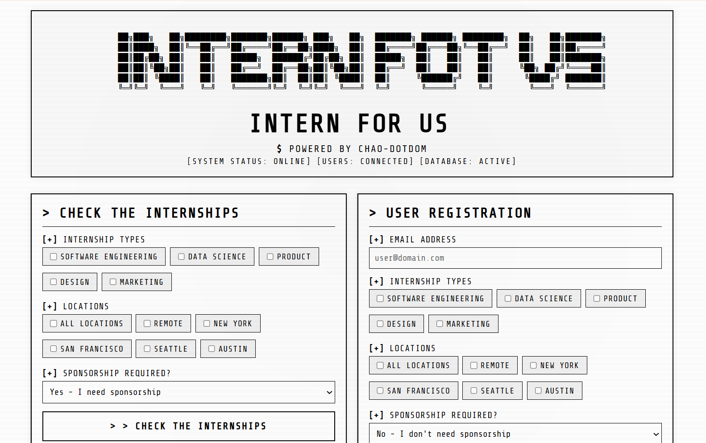
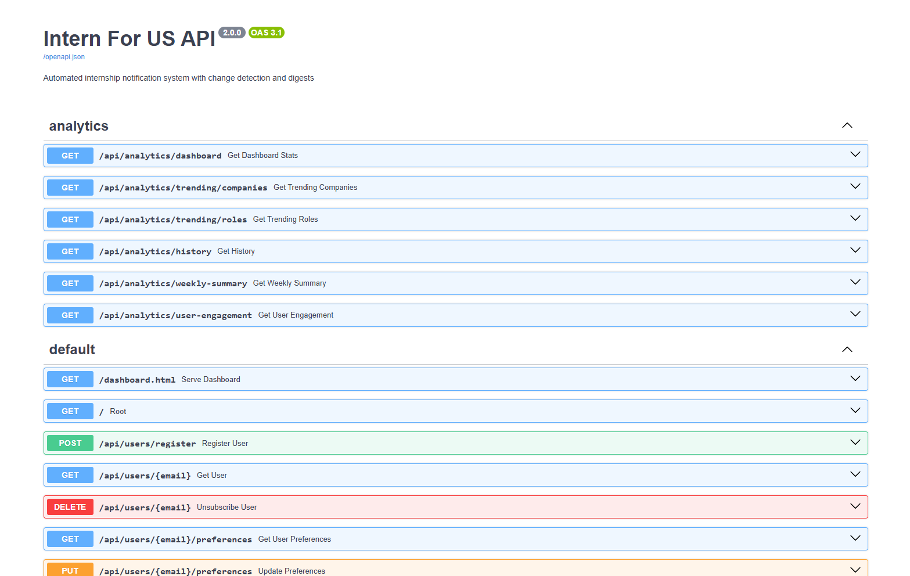
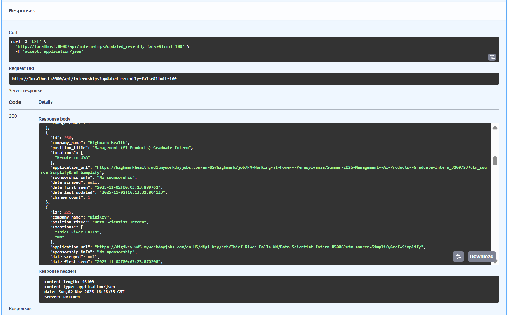

# Intern For US

Get notified when new internships pop up that match what you're looking for. Scrapes the SimplifyJobs Summer2026 internships repo daily and sends you personalized email alerts.

## Demo

### Screenshot


### Video Demo
[](asset/internforus.mp4)

*Click the image above or [watch the demo video](asset/internforus.mp4)*

## What it does

- Scrapes internship listings daily from GitHub
- Lets you filter by job type, location, and sponsorship needs
- Sends email notifications when matches come up
- Tracks changes to existing listings (not just new ones)
- Supports daily/weekly digest emails instead of immediate alerts
- Has analytics to see trending companies and roles

## Built with

- FastAPI for the API (Python 3.10+)
- SQLAlchemy for the database (SQLite dev, PostgreSQL prod)
- APScheduler for scheduled jobs
- SendGrid for emails
- Requests + BeautifulSoup4 for scraping

## Getting started

### Install dependencies

```bash
python -m venv venv
venv\Scripts\activate  # Windows
# source venv/bin/activate  # Mac/Linux

pip install -r requirements.txt
```

### Set up environment variables

Create a `.env` file:

```env
DATABASE_URL=sqlite:///./internships.db
SENDGRID_API_KEY=your_key_here
FROM_EMAIL=your-email@domain.com
SECRET_KEY=some-random-string
```

**Note:** You can leave `SENDGRID_API_KEY` empty if you just want to test without sending emails. Get a free key at https://sendgrid.com (100 emails/day on free tier).

### Initialize the database

```bash
python -m app.init_db
```

### Run it

```bash
uvicorn app.main:app --reload
```

Then open http://localhost:8000 in your browser. The scheduler runs automatically, so you don't need to start it separately. It'll scrape daily at 9 AM and send digest emails hourly.

You can also check out:
- **Interactive API docs** (Swagger UI): http://localhost:8000/docs - **Test all API endpoints directly in your browser!**
- Web dashboard: http://localhost:8000/dashboard.html

## API overview

Main endpoints:

**Users:**
- `POST /api/users/register` - Sign up with your preferences
- `GET /api/users/{email}` - Get user info
- `PUT /api/users/{email}/preferences` - Update preferences
- `DELETE /api/users/{email}` - Unsubscribe

**Internships:**
- `GET /api/internships` - List all (supports filters: `?company=X&location=Y&sponsorship=Z`)
- `GET /api/internships/{id}` - Get specific internship
- `GET /api/internships/{id}/changes` - See change history
- `POST /api/scrape` - Manually trigger a scrape (all sections)
- `POST /api/scrape?section=Software Engineering` - Scrape specific section only

**Analytics:**
- `GET /api/analytics/dashboard` - System stats
- `GET /api/analytics/trending/companies` - Top companies
- `GET /api/analytics/trending/roles` - Popular roles
- `GET /api/analytics/weekly-summary` - Last 7 days summary

**💡 Tip:** You can test all API endpoints directly in the browser! Visit http://localhost:8000/docs to access the interactive Swagger UI where you can:
- See all available endpoints
- View request/response schemas
- Test endpoints with sample data
- Try the `/api/scrape?section=Software Engineering` endpoint to scrape specific sections

### Interactive API Documentation



The Swagger UI provides an intuitive interface to explore and test all endpoints:



## Quick examples

Register a user:
```bash
curl -X POST http://localhost:8000/api/users/register \
  -H "Content-Type: application/json" \
  -d '{
    "email": "you@example.com",
    "preferences": {
      "job_types": ["Software Engineering"],
      "sponsorship_required": false,
      "locations": ["Remote"],
      "notification_frequency": "daily",
      "digest_time": "09:00",
      "digest_day": "monday"
    }
  }'
```

Trigger a scrape:
```bash
# Scrape all sections
curl -X POST http://localhost:8000/api/scrape

# Scrape only Software Engineering internships
curl -X POST "http://localhost:8000/api/scrape?section=Software Engineering"

# Scrape only Data Science internships
curl -X POST "http://localhost:8000/api/scrape?section=Data Science"
```

Get internships:
```bash
curl "http://localhost:8000/api/internships?company=Google&limit=10"
```

## Project structure

```
app/
├── main.py                  # FastAPI app
├── models.py               # Database models
├── database.py             # DB setup
├── config.py               # Settings
├── scraper_enhanced.py     # Scraper with change detection
├── notification_enhanced.py # Email engine (digests + immediate)
├── scheduler_enhanced.py    # Scheduled jobs
├── analytics.py            # Analytics endpoints
└── init_db.py              # DB initialization

dashboard.html              # Web UI
asset/                      # Screenshots and demo videos
requirements.txt            # Dependencies
.env                        # Your config (create this)
```

The basic versions (`scraper.py`, `notification.py`, `scheduler.py`) are still there but the enhanced ones are used by default.

## Testing

```bash
pytest tests/
```

## Deployment

Docker works fine:

```bash
docker build -t intern-for-us .
docker run -p 8000:8000 --env-file .env intern-for-us
```

Or use `docker-compose up` if you want the full stack (PostgreSQL, Redis, etc.).

For cloud deployment, Railway or Render both work well. Just make sure to:
- Set all environment variables
- Use PostgreSQL instead of SQLite for production
- Update the scheduler timezone if needed

## A few things to know

- Scrapes from: `https://raw.githubusercontent.com/SimplifyJobs/Summer2026-Internships/dev/README.md`
- Default scrape time: 9 AM daily (change in `app/scheduler_enhanced.py`)
- Emails only send if SendGrid API key is configured
- SQLite is fine for dev, but switch to PostgreSQL for production

## License

MIT

